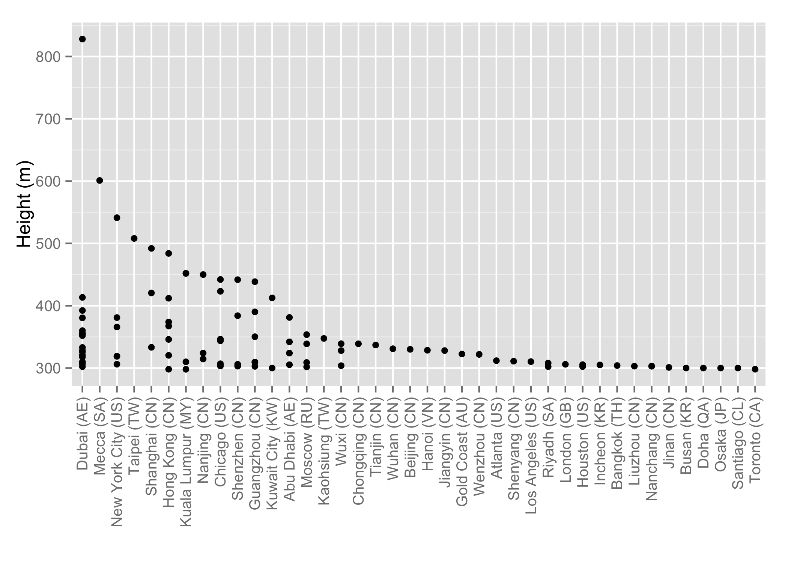

# skyscraper

This R data package -- as of November 25, 2015 -- provides the data for the 100 Tallest Completed Buildings in the World as listed by [The Skyscraper Center](http://www.skyscrapercenter.com/buildings).

This tbl_df includes 9 variables:


|variable       |class     |
|:--------------|:---------|
|rank           |integer   |
|building_name  |character |
|city           |factor    |
|height_m       |numeric   |
|height_ft      |numeric   |
|floors         |integer   |
|year_completed |integer   |
|material       |factor    |
|use            |character |

## Install
You can install `skyscraper` from GitHib:

```r
# install.packages("devtools")
devtools::install_github("csiu/skyscraper")
```

### ... and test drive

```r
library(skyscraper)
library(ggplot2)


ggplot(skyscraper, 
       aes(
         x = reorder(city, height_m, function(x){-max(x)}), 
         y = height_m
       )) +
  geom_point() + 
  xlab("") + 
  ylab("Height (m)") +
  theme(
    axis.text.x = element_text(angle = 90, hjust = 1, vjust = 0.5)
  )
```

 

## Plain text file
I make available the plain text, comma delimited `.csv` file of the skyscraper data:

- [`skyscraper.csv`](inst/skyscraper.csv): the same dataset available via `library(skyscraper); skyscraper`
- If this package is installed on your system, you can find this file via: `system.file("skyscraper.tsv", package="skyscraper")`

## Acknowledgement
This data is from: 

> Skyscrapercenter.com,. (2015). *100 Tallest Completed Buildings in the World - The Skyscraper Center.* Retrieved 25 November 2015, from http://www.skyscrapercenter.com/buildings
